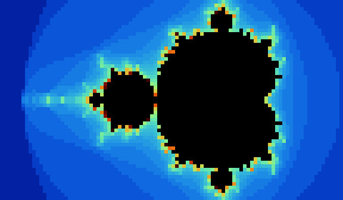

<div align="center">

# 🎬 tinycinema

**Your terminal is a movie theater.**

Play videos — local files or YouTube links — directly in your terminal, with sound.

[](LICENSE)
[](https://www.python.org/downloads/)
[](#roadmap)

</div>

---

> [!NOTE]
> **Video plays. Audio doesn't yet.** Local files and generated test patterns
> render in sync against a wall clock, with seeking, pause, live mode switching
> and resize handling. Audio is Phase 2 and YouTube is Phase 3 — see the
> [roadmap](#roadmap). The full design write-up, including everything considered
> and rejected, is in [DESIGN.md](DESIGN.md).

---

## Demo

Everything below is real renderer output, produced by
[`tools/make_demo_assets.py`](tools/make_demo_assets.py) from the built-in
`mandelbrot` test pattern — no media files, no ffmpeg, no screenshots.
Regenerate at any time with `python tools/make_demo_assets.py`.

<div align="center">

#### `--mode halfblock` — the default



Two independently coloured pixels per character cell, via `▀`.

<br>

#### `--demo bars` — check your terminal's colour handling


</div>

#### `--mode ascii` — one character per cell, from a luminance ramp

```
............:::::---------------------------====+*%*#+=-----------::::::::::::
..........:::::---------------------------====++*#=#*+===-----------::::::::::
.........::::---------------------------=====+*%    %%*=====----------::::::::
.........::--------------------------=====++++**     #*++======---------::::::
........::----------------------=====+*###*#.#        *##%++***==--------:::::
.......::------------------==========+*%  -               %  =*+==--------::::
.......:--------------=============+%%*                     %*++==---------:::
......:------------===+*++++*+++++++##                       -#*#=----------::
......----------======+*#*%*#:##****%                         %*+=-----------:
......--------======++**#%       %##                           %+=-----------:
.....-------=====++%***%                                      %+==-----------:
.....-====+++++++**#%                                        #+===-----------:
.....-====+++++++**#%                                        #+===-----------:
.....-------=====++%***%                                      %+==-----------:
......--------======++**#%       %##                           %+=-----------:
......----------======+*#*%*#:##****%                         %*+=-----------:
......:------------===+*++++*+++++++##                       -#*#=----------::
.......:--------------=============+%%*                     %*++==---------:::
.......::------------------==========+*%  -               %  =*+==--------::::
........::----------------------=====+*###*#.#        *##%++***==--------:::::
.........::--------------------------=====++++*+     #*++======---------::::::
.........::::---------------------------=====+*%    %%*=====----------::::::::
..........:::::---------------------------====++*#=#*+===-----------::::::::::
............:::::---------------------------====+*%*#+=-----------::::::::::::
```

#### `--mode braille --contrast 6` — 2×4 dots per cell, the finest text can do

```
⠀⠀⠀⠀⠀⠀⠀⠀⠀⠀⠀⠀⠀⠀⠀⠀⠀⠀⠀⠀⠀⠀⠀⠀⠀⠀⠀⠀⠀⠀⠀⠀⠀⠀⠀⠀⠀⠀⠀⠀⡠⡀⡢⣊⣢⣺⣿⣿⠉⠀⠀⠀⠩⣹⣿⣪⡢⡀⡀⠀⠀⠀⠀⠀⠀⠀⠀⠀⠀⠀⠀⠀⠀⠀⠀⠀⠀⠀
⠀⠀⠀⠀⠀⠀⠀⠀⠀⠀⠀⠀⠀⠀⠀⠀⠀⠀⠀⠀⠀⠀⠀⠀⠀⠀⠀⠀⠀⠀⠀⠀⠀⠀⠀⠀⠀⣀⣢⣾⣦⣾⣮⣾⣾⣿⣿⣿⡀⠀⠀⠀⣠⣾⣿⣿⣮⣮⣢⣊⣢⣢⣦⡀⠀⠀⠀⠀⠀⠀⠀⠀⠀⠀⠀⠀⠀⠀
⠀⠀⠀⠀⠀⠀⠀⠀⠀⠀⠀⠀⠀⠀⠀⠀⠀⠀⠀⠀⠀⠀⠀⠀⠀⠀⠀⠀⠀⠀⠀⠀⠀⠀⠀⡀⡢⣺⣿⣿⡚⠿⢿⠿⠏⠟⠘⠀⠈⠁⠀⠈⠁⠈⠁⠛⢃⢿⣿⣿⣾⣿⣿⣮⠀⠀⠀⠀⠀⠀⠀⠀⠀⠀⠀⠀⠀⠀
⠀⠀⠀⠀⠀⠀⠀⠀⠀⠀⠀⠀⠀⠀⠀⠀⠀⠀⠀⠀⠀⠀⠀⠀⠀⠀⠀⠀⠀⠀⠀⠀⠀⡀⡢⡊⣢⣾⣿⣿⡃⠀⠈⠀⠀⠀⠀⠀⠀⠀⠀⠀⠀⠀⠀⠀⠀⠀⠙⠋⠀⠠⣿⡋⡂⠀⠀⠀⠀⠀⠀⠀⠀⠀⠀⠀⠀⠀
⠀⠀⠀⠀⠀⠀⠀⠀⠀⠀⠀⠀⠀⠀⠀⠀⠀⠀⠀⠀⠀⠀⣠⡀⡠⡀⡀⡀⡀⡀⡠⡀⣢⣊⣢⣺⣿⣟⠻⠏⠁⠀⠀⠀⠀⠀⠀⠀⠀⠀⠀⠀⠀⠀⠀⠀⠀⠀⠀⠀⠐⢻⢿⣺⡢⠀⠀⠀⠀⠀⠀⠀⠀⠀⠀⠀⠀⠀
⠀⠀⠀⠀⠀⠀⠀⠀⠀⠀⠀⠀⠀⠀⠀⠀⠀⠀⠀⠀⠠⡊⣿⣿⣮⣾⣪⣾⣾⣾⣮⣺⣪⣾⣾⣿⡿⠧⠀⠀⠀⠀⠀⠀⠀⠀⠀⠀⠀⠀⠀⠀⠀⠀⠀⠀⠀⠀⠀⠀⠀⠀⠟⢿⣿⡂⠀⠀⠀⠀⠀⠀⠀⠀⠀⠀⠀⠀
⠀⠀⠀⠀⠀⠀⠀⠀⠀⠀⠀⠀⠀⠀⠀⠀⠀⠀⠀⠀⡢⣺⣻⣿⣿⡿⢿⡿⣟⠛⣿⢿⣿⣿⣿⣿⡑⠁⠀⠀⠀⠀⠀⠀⠀⠀⠀⠀⠀⠀⠀⠀⠀⠀⠀⠀⠀⠀⠀⠀⠀⠀⠰⣿⣯⡂⠀⠀⠀⠀⠀⠀⠀⠀⠀⠀⠀⠀
⠀⠀⠀⠀⠀⠀⠀⠀⠀⠀⠀⠀⠀⠀⠀⠀⠀⠀⠀⣨⣪⣺⣾⣿⡿⠀⠈⠁⠀⠀⠀⠈⠙⠻⣿⣗⠀⠀⠀⠀⠀⠀⠀⠀⠀⠀⠀⠀⠀⠀⠀⠀⠀⠀⠀⠀⠀⠀⠀⠀⠀⠀⠠⣹⡯⠂⠀⠀⠀⠀⠀⠀⠀⠀⠀⠀⠀⠀
⠀⠀⠀⠀⠀⠀⠀⠀⠀⠀⠀⠀⡀⡀⡠⡂⣢⣺⣾⣿⣿⣿⣿⡗⠀⠀⠀⠀⠀⠀⠀⠀⠀⠀⠙⡇⠀⠀⠀⠀⠀⠀⠀⠀⠀⠀⠀⠀⠀⠀⠀⠀⠀⠀⠀⠀⠀⠀⠀⠀⠀⠀⢰⡿⡢⠀⠀⠀⠀⠀⠀⠀⠀⠀⠀⠀⠀⠀
⠀⠀⠀⠀⠀⣀⣀⣀⣢⣲⣲⣾⣦⣮⣦⣾⣾⣾⣿⣿⠏⠉⠉⠀⠀⠀⠀⠀⠀⠀⠀⠀⠀⠀⠀⠁⠀⠀⠀⠀⠀⠀⠀⠀⠀⠀⠀⠀⠀⠀⠀⠀⠀⠀⠀⠀⠀⠀⠀⠀⢀⣴⣿⡊⡂⠀⠀⠀⠀⠀⠀⠀⠀⠀⠀⠀⠀⠀
⠀⠀⠀⠀⠀⠈⠈⠊⠫⠻⠻⡻⡻⡛⡻⣻⣿⣿⣿⣿⣆⣀⣀⡀⠀⠀⠀⠀⠀⠀⠀⠀⠀⠀⠀⡀⠀⠀⠀⠀⠀⠀⠀⠀⠀⠀⠀⠀⠀⠀⠀⠀⠀⠀⠀⠀⠀⠀⠀⠀⠈⠻⣯⡊⡂⠀⠀⠀⠀⠀⠀⠀⠀⠀⠀⠀⠀⠀
⠀⠀⠀⠀⠀⠀⠀⠀⠀⠀⠀⠀⠀⠊⠢⠊⠪⡺⣻⣿⣿⣿⣿⡧⠀⠀⠀⠀⠀⠀⠀⠀⠀⠀⣠⡇⠀⠀⠀⠀⠀⠀⠀⠀⠀⠀⠀⠀⠀⠀⠀⠀⠀⠀⠀⠀⠀⠀⠀⠀⠀⠀⠸⣻⡢⠀⠀⠀⠀⠀⠀⠀⠀⠀⠀⠀⠀⠀
⠀⠀⠀⠀⠀⠀⠀⠀⠀⠀⠀⠀⠀⠀⠀⠀⠀⠀⠀⠚⣫⣻⣿⣿⣷⠀⢀⡀⠀⠀⠀⢀⣠⣴⣿⡯⠀⠀⠀⠀⠀⠀⠀⠀⠀⠀⠀⠀⠀⠀⠀⠀⠀⠀⠀⠀⠀⠀⠀⠀⠀⠀⠐⣹⣦⡀⠀⠀⠀⠀⠀⠀⠀⠀⠀⠀⠀⠀
⠀⠀⠀⠀⠀⠀⠀⠀⠀⠀⠀⠀⠀⠀⠀⠀⠀⠀⠀⠀⠢⣺⣾⣿⣿⣷⣾⣷⣯⣤⣿⣾⣿⣿⣿⣿⡡⡀⠀⠀⠀⠀⠀⠀⠀⠀⠀⠀⠀⠀⠀⠀⠀⠀⠀⠀⠀⠀⠀⠀⠀⠀⠰⣿⣯⡂⠀⠀⠀⠀⠀⠀⠀⠀⠀⠀⠀⠀
⠀⠀⠀⠀⠀⠀⠀⠀⠀⠀⠀⠀⠀⠀⠀⠀⠀⠀⠀⠀⠀⡊⣿⣿⣿⣻⣻⣻⣿⣿⣻⣻⣫⣻⣿⣿⣶⡖⠀⠀⠀⠀⠀⠀⠀⠀⠀⠀⠀⠀⠀⠀⠀⠀⠀⠀⠀⠀⠀⠀⠀⠀⣦⣾⣿⡂⠀⠀⠀⠀⠀⠀⠀⠀⠀⠀⠀⠀
⠀⠀⠀⠀⠀⠀⠀⠀⠀⠀⠀⠀⠀⠀⠀⠀⠀⠀⠀⠀⠀⠈⠋⠋⠂⠊⠂⠈⠀⠈⠂⠊⡪⡊⡪⣻⣿⣯⣴⣆⡀⠀⠀⠀⠀⠀⠀⠀⠀⠀⠀⠀⠀⠀⠀⠀⠀⠀⠀⠀⠠⣼⣾⡻⡢⠀⠀⠀⠀⠀⠀⠀⠀⠀⠀⠀⠀⠀
⠀⠀⠀⠀⠀⠀⠀⠀⠀⠀⠀⠀⠀⠀⠀⠀⠀⠀⠀⠀⠀⠀⠀⠀⠀⠀⠀⠀⠀⠀⠀⠀⠀⠈⠢⡊⡪⣻⣿⣿⡅⠀⢀⠀⠀⠀⠀⠀⠀⠀⠀⠀⠀⠀⠀⠀⠀⠀⣠⡄⠀⠐⣿⣎⡂⠀⠀⠀⠀⠀⠀⠀⠀⠀⠀⠀⠀⠀
⠀⠀⠀⠀⠀⠀⠀⠀⠀⠀⠀⠀⠀⠀⠀⠀⠀⠀⠀⠀⠀⠀⠀⠀⠀⠀⠀⠀⠀⠀⠀⠀⠀⠀⠀⠈⠢⣺⣿⣿⢥⣶⣾⣶⣆⣦⢠⠀⢀⡀⠀⢀⡀⢀⡀⣤⡌⣾⣿⣿⣿⣿⣿⡟⠀⠀⠀⠀⠀⠀⠀⠀⠀⠀⠀⠀⠀⠀
⠀⠀⠀⠀⠀⠀⠀⠀⠀⠀⠀⠀⠀⠀⠀⠀⠀⠀⠀⠀⠀⠀⠀⠀⠀⠀⠀⠀⠀⠀⠀⠀⠀⠀⠀⠀⠀⠈⠻⡻⡻⡻⣻⣻⣿⣿⣿⣿⠁⠀⠀⠀⠙⢿⣿⣿⣿⡛⡫⡊⡪⠚⠋⠀⠀⠀⠀⠀⠀⠀⠀⠀⠀⠀⠀⠀⠀⠀
⠀⠀⠀⠀⠀⠀⠀⠀⠀⠀⠀⠀⠀⠀⠀⠀⠀⠀⠀⠀⠀⠀⠀⠀⠀⠀⠀⠀⠀⠀⠀⠀⠀⠀⠀⠀⠀⠀⠀⠈⠀⠊⠢⡊⡪⣺⣿⣿⣀⠀⠀⠀⣐⣹⣿⡚⠂⠊⠀⠀⠀⠀⠀⠀⠀⠀⠀⠀⠀⠀⠀⠀⠀⠀⠀⠀⠀⠀
```

## Install

Not on PyPI yet. From source:

```bash
git clone https://github.com/rhelgason/tinycinema.git
cd tinycinema
python -m venv .venv && source .venv/bin/activate
pip install -e ".[dev]"
```

### Requirements

| | |
|---|---|
| **Python 3.11+** | |
| **numpy** | installed automatically |
| **ffmpeg** | required to play actual media (`--demo` works without it) |
| **A truecolor terminal** | recommended; degrades to 256-colour and mono |

```bash
brew install ffmpeg          # macOS
sudo apt install ffmpeg      # Debian / Ubuntu
```

If your ffmpeg lives somewhere unusual, point at it with `TINYCINEMA_FFMPEG`
(and `TINYCINEMA_FFPROBE`).

Run `tinycinema --doctor` to check your setup, see which render modes your
terminal supports, and eyeball a glyph and colour test.

## Usage

```bash
# no media handy? no ffmpeg? this still works
tinycinema --demo
tinycinema --demo mandelbrot

# a local file
tinycinema clip.mp4
tinycinema clip.mp4 --mode braille --contrast 3
tinycinema clip.mp4 --start 1:30 --loop

# a single frame — thumbnails for scripts
tinycinema clip.mp4 --once --start 00:01:30

# pipe it (implies --once, plain text, no escapes)
tinycinema clip.mp4 --once > frame.txt
```

Built-in test patterns: `ball`, `plasma`, `bars`, `mandelbrot`.

### Controls

| Key | Action |
|---|---|
| <kbd>space</kbd> / <kbd>k</kbd> | pause / resume |
| <kbd>←</kbd> <kbd>→</kbd> | seek ∓5s |
| <kbd>j</kbd> <kbd>l</kbd> | seek ∓10s |
| <kbd>↑</kbd> <kbd>↓</kbd> | seek ±60s |
| <kbd>r</kbd> / <kbd>R</kbd> | cycle render mode forward / back |
| <kbd>c</kbd> | toggle colour |
| <kbd>h</kbd> | toggle HUD |
| <kbd>q</kbd> / <kbd>esc</kbd> | quit |

### Options

```
--mode MODE       ascii | ascii-color | blocks | halfblock | braille | auto
--ramp NAME       blocks | standard | long | binary
--width / --height    override the auto-detected cell grid
--fps N           cap the render rate
--no-color        monochrome output
--gamma / --contrast / --brightness
--dither          none | ordered
--threshold F     on/off cutoff for braille mode
--start TIME      seconds, MM:SS or HH:MM:SS
--loop            repeat forever
--once            render one frame and exit
--no-hud          hide the status bar
--stats           print a timing summary on exit
--doctor          diagnose ffmpeg and terminal capabilities
```

Full list: `tinycinema --help`.

## How it works

```
source ──► resolve ──► ffmpeg demux/decode ──┬──► audio sink ──► 🔊   (Phase 2)
(file/URL)                                   │        │
                                             │        └── playback position = the clock
                                             │                      │
                                             └──► frames ──► encode ──► diffed writer ──► 📺
                                                   (drop if behind the clock)
```

Three ideas do most of the work:

**1. Half-block cells.** The character `▀` gives you two independently-coloured
pixels per terminal cell — 2× the vertical resolution, and it makes the effective
pixels *square*, since cells are about twice as tall as they are wide.

This turns out to matter everywhere. Each renderer declares its effective pixel
aspect (1.0 for half-block and braille, 0.5 for one-pixel-per-cell modes) and the
decoder divides through by it when letterboxing. Skip that step and ffmpeg's
`force_original_aspect_ratio` — which assumes square pixels — squeezes ascii mode
into half the width and stretches it to twice the height.

**2. Audio is the master clock.** People notice an audio glitch instantly and a
dropped video frame almost never. So audio plays uninterrupted and video chases
it, dropping any frame that would land more than ~1.5 frame intervals late. Never
accumulate debt: rendering every frame late is far worse than rendering most on
time. (Phase 1 uses a wall clock in the same shape, so Phase 2 swaps one method.)

**3. Only repaint what changed.** A naive full-colour repaint of a 200×50 grid is
~420 KB per frame — 12.6 MB/s at 30 fps, which chokes most terminals and is
hopeless over SSH. The writer diffs against the previous frame, coalesces SGR
colour escapes, and groups changed cells into runs so it pays one cursor-move per
run rather than one per cell.

Getting that fast in Python needed one more trick: per-cell numpy scalar indexing
costs ~2 µs a cell, which at 7680 cells is 15 ms a frame spent purely on boxing.
Packing each cell's two colours into a single `int64` makes the diff one
vectorised comparison, and since uint32 codepoints *are* UTF-32, a row of
characters reinterprets as a Python string via `.view()` for free.

Measured at 160×48 on a 30 fps source: **149/149 frames, 30.1 fps, zero drops.**

## Roadmap

- [x] **Phase 0** — project skeleton, `--doctor`, generated test patterns
- [x] **Phase 1** — silent playback of local files, seeking, HUD, resize handling
- [ ] **Phase 2** — audio + A/V sync 🎯 _the good part_
- [ ] **Phase 3** — YouTube URLs via yt-dlp, with a local cache
- [ ] **Phase 4** — frame stepping, volume, playlists, `--record`
- [ ] **Phase 5** — Kitty/iTerm2/sixel inline images, PyPI release

## Development

```bash
pytest                              # 159 tests, no video or tty required
python tools/make_demo_assets.py    # regenerate the README images
tinycinema --demo --stats           # quick smoke test
```

The test suite deliberately needs no media and no terminal: the writer is
verified with golden byte strings, the renderers with exact cell grids, and the
timing loop against a fake clock.

## Contributing

Early days — issues and ideas are the most useful contribution right now.
[DESIGN.md](DESIGN.md) has the module layout, the full menu of render modes, and
an honest list of the parts that are genuinely hard.

## Prior art & thanks

Standing on the shoulders of a long line of terminal-video hacks — `mpv`'s
`--vo=tct`, `hasciicam`, `ascii-image-converter`, `chafa`, `timg`, `catimg`, and
of course the original `telnet towel.blinkenlights.nl`. `ffmpeg` and `yt-dlp` do
the actual heavy lifting.

## License

[MIT](LICENSE) © 2026 Ryan Helgason
